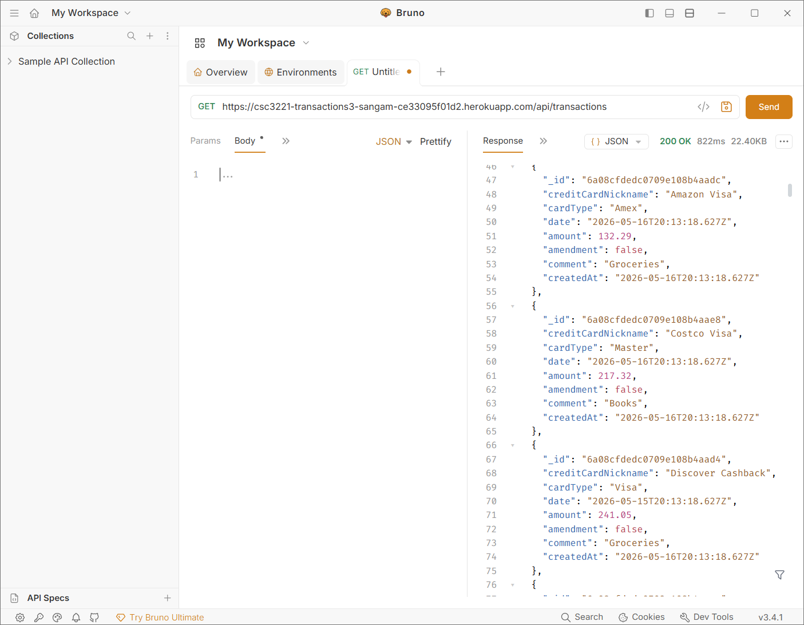
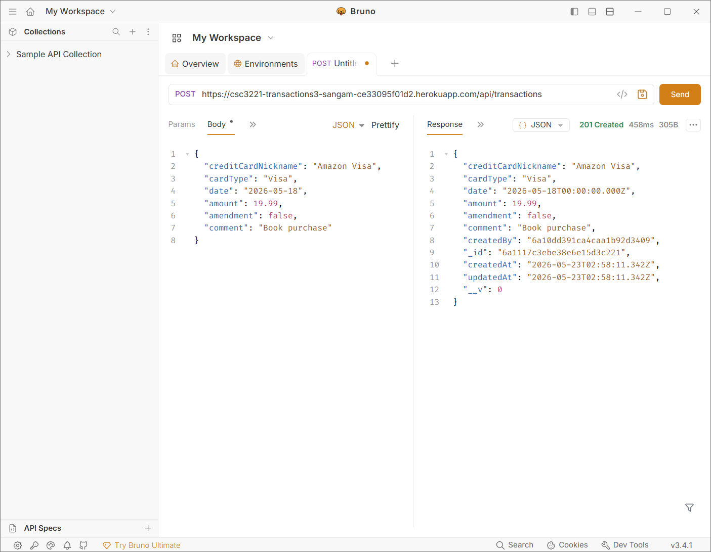
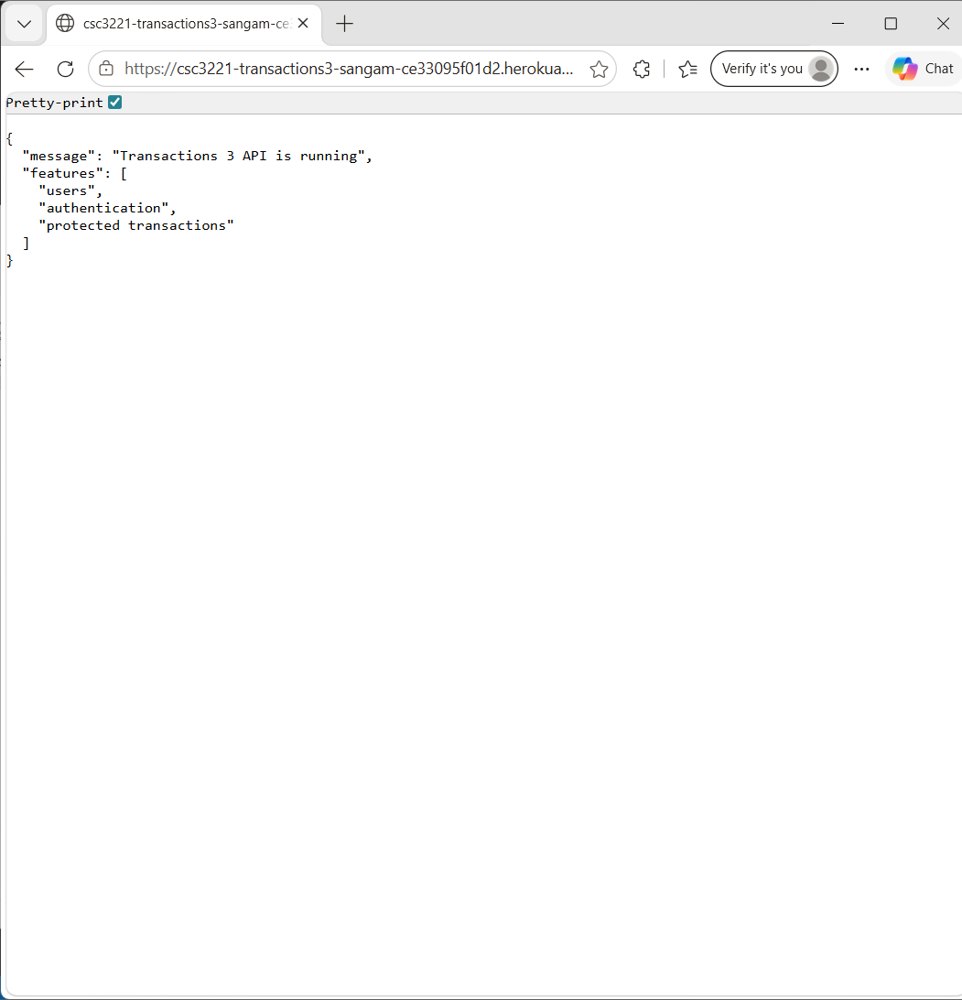
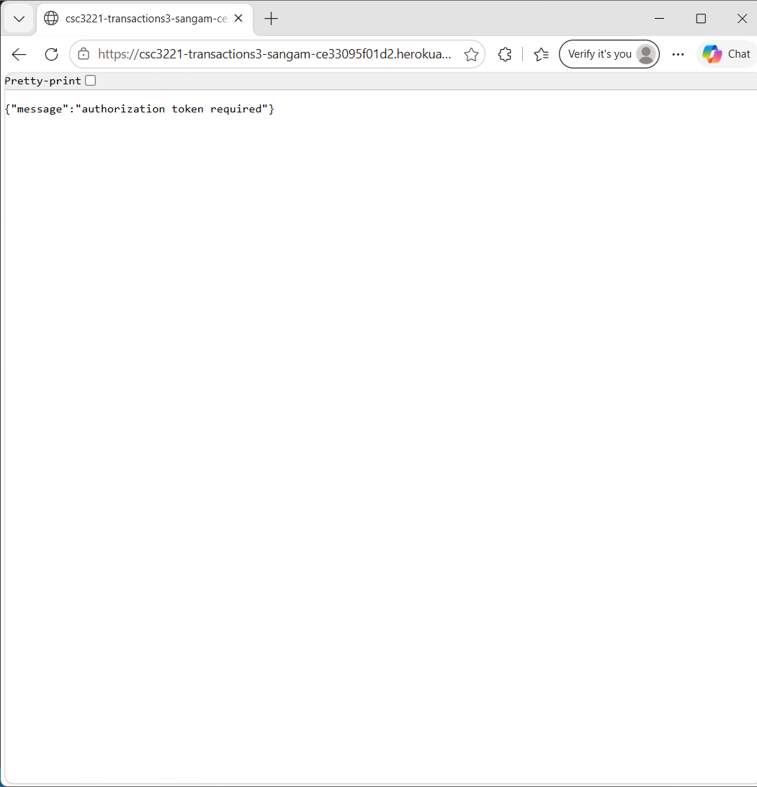

# transactions3-api

# Transactions 3 API - Deployment & Authentication

This repository contains the third iteration of the Transactions API, built using Node.js, Express, MongoDB, and Mongoose. This version introduces robust user authentication utilizing JSON Web Tokens (JWT) and password hashing via `bcryptjs`, structured using the professional back-end architecture pattern: **Client → Route → Middleware → Controller → Model → Database**.

---

## App URL

* **Heroku Production URL:** [https://transactions-api-sangampraz-dfda5969908e.herokuapp.com/](https://transactions-api-sangampraz-dfda5969908e.herokuapp.com/) *(Replace with your actual Heroku app URL)*

---

## Running my App (Postman)
#### GET

#### POST

---

## Running my App (Browser)

### Browser Access Test
Browser URL: (`https://transactions-api-sangampraz-dfda5969908e.herokuapp.com/`)

I was able to test GET /api/transactions, however, protected routes requred a JWT token, which is easier to test in POSTMAN because the browser does not automatically send Bearer tokens. 
---

### What differences?
One major difference between deploy-app-02-s26 and deploy-app-03-s26 was the addition of authentication and authorization.

#### deploy-app-02-s26
* The API mostly focused on CRUD operations
* There was no user login system
* Routes were public
* Password hashing and JWT tokens were not used
* The application structure was simpler

#### deploy-app-03-s26
* Authentication was added using JWT tokens
* Passwords were securely hashed using bcryptjs
* Middleware was added to protect routes
* Models, controllers, and routes were separated into different folders
* Protected endpoints required Bearer tokens
* The application followed a more professional backend architecture

This version felt much closer to a real production backend application.

---

### What model code do you prefer, 02's or 03's?

I prefer the model structure used in deploy-app-03-s26. 

Here are few reasons:
* The code is cleaner and more organized
* Models separate database logic from routes and controllers
* Controllers handle request logic separately
* Middleware makes authentication reusable
* The architecture is easier to maintain and scale
* It follows professional backend development practices

Using models and controllers made the application easier to understand once everything was connected together.

---

### Challenges: Write the challenges you faced during this exercise and how you solved them
One challenge I faced was understanding how JWT authentication worked together with middleware. At first I forgot to include the Bearer token in Postman request and I received the error. Then I had to find the auth part and add the bearer token manually which solved the problem. 

---

### Questions
Some questions I still have after completing this project are:

1. How are JWT tokens refreshed in large production applications?
2. What is the best way to securely store tokens on the frontend?
3. How would role-based permissions be expanded for larger applications?
4. How would pagination and search optimization be implemented for millions of transactions?
5. How would this backend connect to a React or mobile frontend application?
6. What are the best practices for organizing large Express applications with many routes and controllers?

---

###### Author
Sangam Prajapati